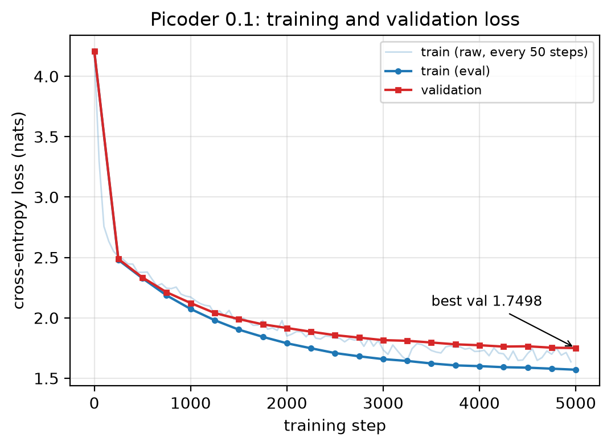
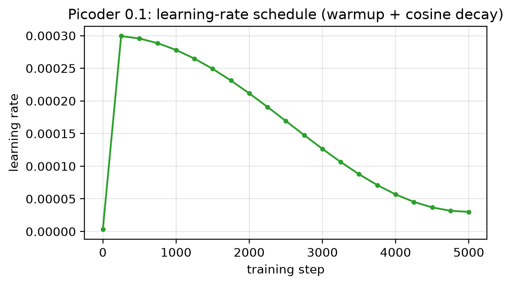
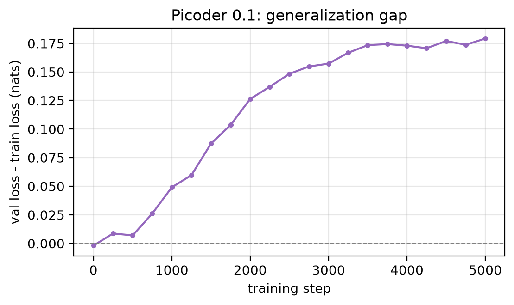
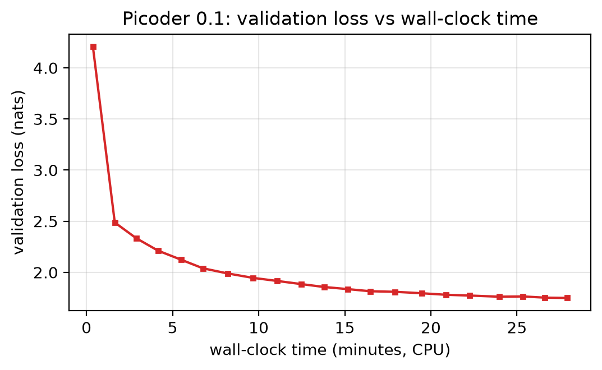
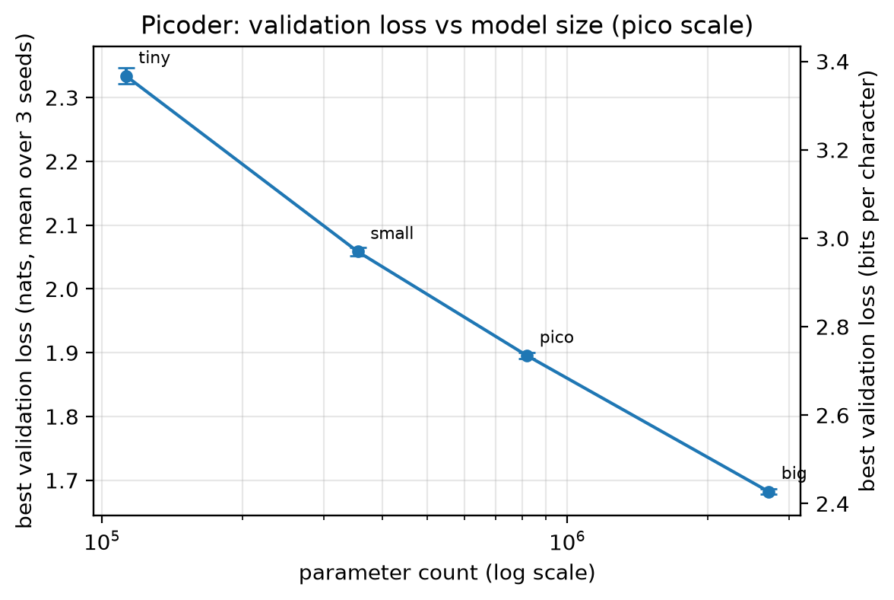

# Picoder 0.1: Results and Figures

This page collects the figures for the Picoder 0.1 baseline run, with captions
written so they can drop straight into the paper. All figures are generated by
`make_figures.py` from the run log and are available as both PNG (preview) and
PDF (vector, for LaTeX) in `docs/figures/`.

## Run summary

| Item | Value |
| --- | --- |
| Model | decoder-only transformer ("pico") |
| Parameters | 818,048 (0.818M) |
| Tokenizer | character-level, vocab 65 |
| Data | TinyShakespeare, 1,003,855 train / 111,539 val tokens |
| Steps | 5000 |
| Optimizer | AdamW, lr 3e-4, warmup 100 + cosine decay to 3e-5 |
| Hardware | CPU (Apple Silicon), float32 |
| **Best val loss** | **1.7498** |
| Final train loss | 1.5706 |
| Wall-clock | 1675 s (~28 min), ~0.33 s/step |
| Seed | 1337 |

## Figure 1: Training and validation loss



**Caption.** Cross-entropy loss (in nats) versus training step for the Picoder
0.1 "pico" model (0.818M parameters) on TinyShakespeare. The faint line is the
raw per-step training loss (logged every 50 steps); the bold markers are the
train and validation loss measured at each evaluation (every 250 steps, averaged
over 200 batches). Validation loss decreases nearly monotonically (one small
fluctuation at step 4500) from 4.21 to 1.75 and is still falling at step 5000,
indicating the model is undertrained rather than overfit. Files: `fig1_loss_curves.png`, `fig1_loss_curves.pdf`.

## Figure 2: Learning-rate schedule



**Caption.** The learning-rate schedule: a short linear warmup over the first
100 steps to the peak rate of 3e-4, followed by cosine decay to a floor of 3e-5
at step 5000. Files: `fig2_lr_schedule.png`, `fig2_lr_schedule.pdf`.

## Figure 3: Generalization gap



**Caption.** The generalization gap (validation loss minus training loss) versus
step. The gap grows slowly and remains small (about 0.18 nats at step 5000),
consistent with a model that has not yet overfit the corpus at this scale and
training length. Files: `fig3_generalization_gap.png`, `fig3_generalization_gap.pdf`.

## Figure 4: Validation loss versus wall-clock time



**Caption.** Validation loss as a function of wall-clock training time on CPU.
The full 5000-step run completes in about 28 minutes, showing that this "pico"
configuration is trainable end to end on a consumer CPU. Files:
`fig4_loss_vs_time.png`, `fig4_loss_vs_time.pdf`.

## Figure 5: Validation loss versus model size



**Caption.** Best validation loss versus parameter count for four configurations
(112K, 354K, 818K, and 2.71M parameters), each trained with three seeds at an
equal 3000-step budget; error bars show the standard deviation over seeds (they
are smaller than the markers). Loss falls almost linearly in the log of the
parameter count, about -0.47 nats (-0.68 bits per character) per tenfold
increase, with no sign of saturation across this range. The right axis shows the
same values in bits per character. Files: `fig5_scaling.png`, `fig5_scaling.pdf`.

## Reproducing the figures

```bash
# After a training run that wrote checkpoints/pico/train_log.jsonl:
python make_figures.py
# Or point at a different run / output directory:
python make_figures.py --out-dir checkpoints/pico --fig-dir docs/figures
```

## Qualitative sample

A sample generated from the best checkpoint (temperature 0.5, top-k 40, prompt
"ROMEO:") is in `samples/v0.1_samples.txt`. At val loss ~1.75 the model produces
correct play layout (speaker labels, line breaks, speeches) and mostly real
English words, but is not yet sentence-level coherent. This is the expected
"structure before fluency" regime at sub-1M parameters.
